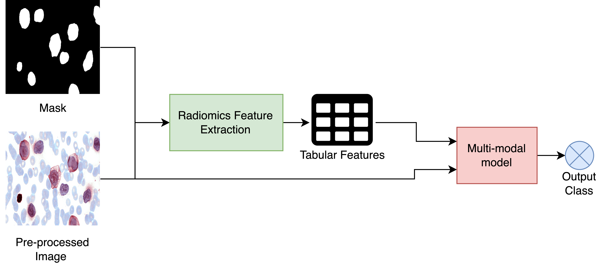

# Cell-Segmentation-in-Hematology-MIL

This repository contains the implementation and documentation for our research on enhancing leukemia subtype classification through innovative machine learning techniques. Developed at Mohamed Bin Zayed University of Artificial Intelligence, this project integrates Multiple Instance Learning (MIL) with advanced cell-level segmentation to address the complexities of diagnosing different leukemia subtypes accurately.

## Background

Leukemia is a complex blood cancer characterized by the rapid proliferation of abnormal blood cells. Accurate classification of leukemia subtypes is crucial due to their distinct progression rates and treatment responses. Our research tackles the inherent challenges of subtype differentiation by leveraging advanced segmentation to examine cellular structures meticulously, employing MIL to consider each patient’s samples collectively, thus ensuring unified diagnostic outputs.

## Architectures

**MIL Architecture:**


**Pre-processing:**


**Post-processing:**


**Multi-modal:**



**DeepLab Segmentation**


## Repository Structure

* `Data Pre and Post Processing/`: Source code containing all scripts for pre-processing the histopathology images including stain normalization and the mask post-processing
* `Classification/`: This folder contains code to train and test the baseline classification models including ResNet50, DenseNet121 and ViT
* `Segmentation/`: Source code for training the DeepLabV3 segmentation model and inferencing the segmentation masks
* `Radiomics Features/`: Source code to extract the radiomics features of white blood cells using generated masks
* `Multi-Modal Model/`: This folder contains code to train the multi-modal model with ViT and ConvNext model along with radiomics tabular features
* `Mask Attention/`: Source code for ablation experiment to use mask attention to aid in classification
* `Tabular Attention/`: Source code for ablation experiment to implement tabular attention
* `Multiple Instance Learning/`: This folder contains code to train the MIL model to patchify histopathology images and use bagging to predict diagnosis
* `data/`: This folder contains demo input and output files to test the code
* `README.md`: Overview and setup instructions.
* `requirements.txt`: Required libraries for the project.

## Installation

Clone this repository and install the required Python packages:

```bash
git clone https://github.com/salmasoma/Cell-Segmentation-in-Hematology-MIL.git
cd Cell-Segmentation-in-Hematology-MIL 
pip install -r requirements.txt`
```

## Training

To train the classification models:

```bash
cd Classification
python train.py
```

To train the Multiple Instance Learning Models:

```bash
cd "Multiple Instance Learning"
python main.py --dataset_name RA --PATH_patches data.csv --embedding_vector_size 1024 --learning_rate 0.0001 --pooling_ratio 0.7 --heads 2 --K 3 --train_fraction 0.7 --num_epochs 30 --n_classes 5
```
## Model Weights

Weights of best models achieved can be downloaded from [Link](https://mbzuaiac-my.sharepoint.com/:f:/g/personal/salma_hassan_mbzuai_ac_ae/Emj8dwmytAtErrEd7l-rOgUBXxp78DlXMYq8w7RmhREvxA?e=QjtZfZ)
## Methodology

### Data Preprocessing

Images from the SSMC dataset undergo rigorous preprocessing, including stain normalization using the `torchstain` library’s `MacenkoNormalizer` and resizing to uniform dimensions to mitigate inconsistencies in staining and scale.

### Segmentation Masks

Using the MedSAM model, segmentation masks are manually created for each image, delineating the regions containing white blood cells, which are critical for subsequent analysis phases.

### MIL Framework

Our MIL framework treats segmented regions from each patient’s sample as instances within a bag, enhancing the model's ability to focus on and learn from critical morphological features necessary for accurate classification.

### Tabular Attention Experiment

We employ tabular attention to dynamically weigh the importance of extracted features, significantly refining the model's focus and improving its diagnostic accuracy.

## Contributions

* **Unified Diagnostic Framework Using MIL** : Addresses inconsistencies in diagnosis across separate samples.
* **Enhanced Feature Extraction through Cell-Level Segmentation** : Improves the model’s ability to detect critical differences between leukemia cells.
* **Advanced Stain Normalization** : Ensures diagnostic consistency across varied lab procedures.

## Challenges and Future Directions

While promising, our approach faces challenges in dataset generalizability and capturing the full diversity of leukemia subtypes. Future work will aim to expand the dataset variety and integrate real-time analysis capabilities to enhance the model's applicability in clinical settings.
